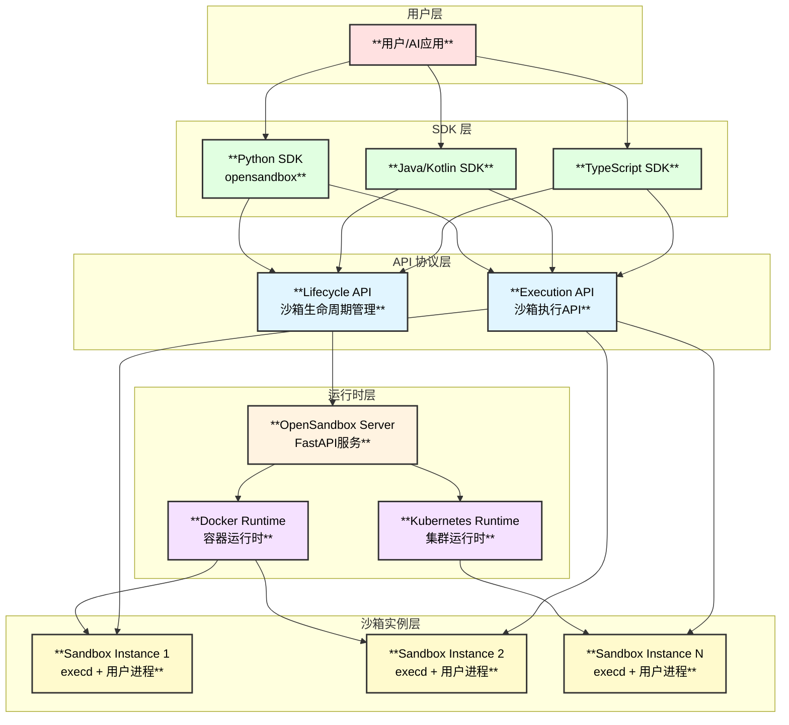
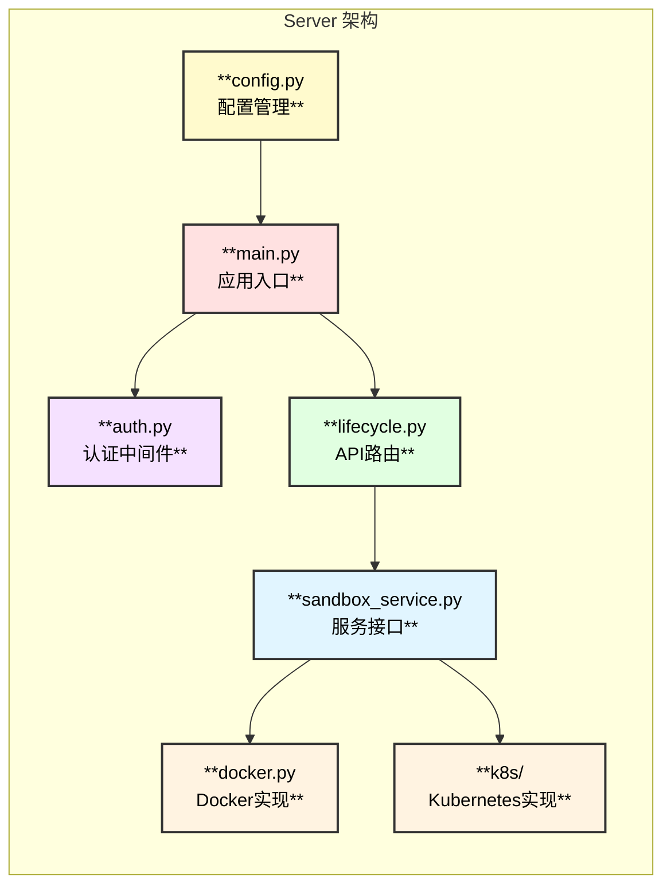
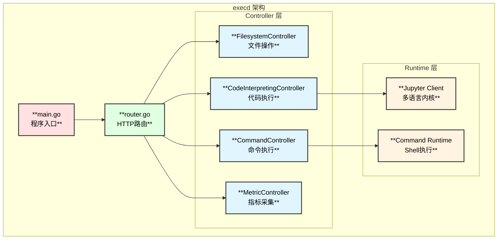
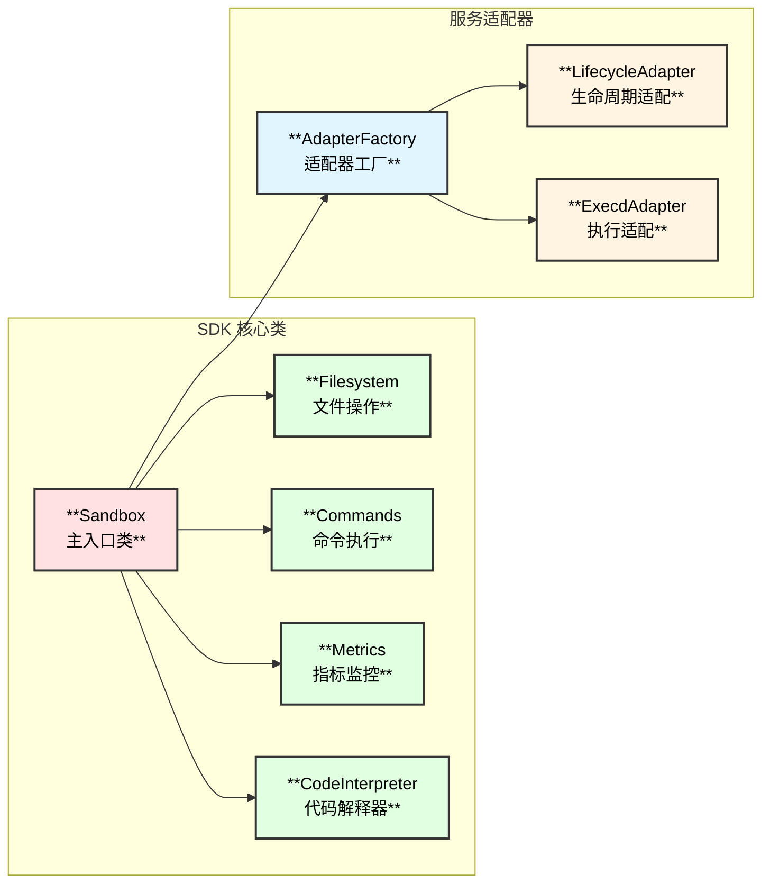
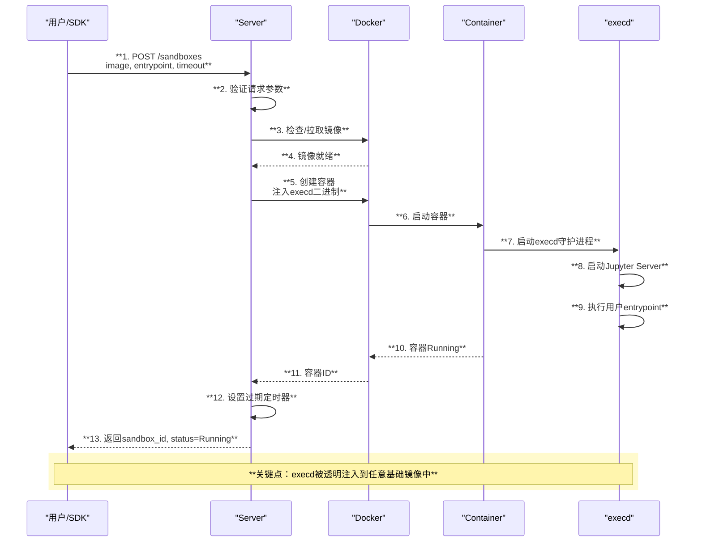
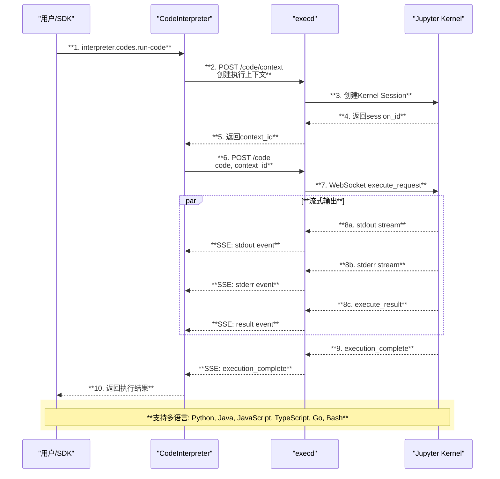
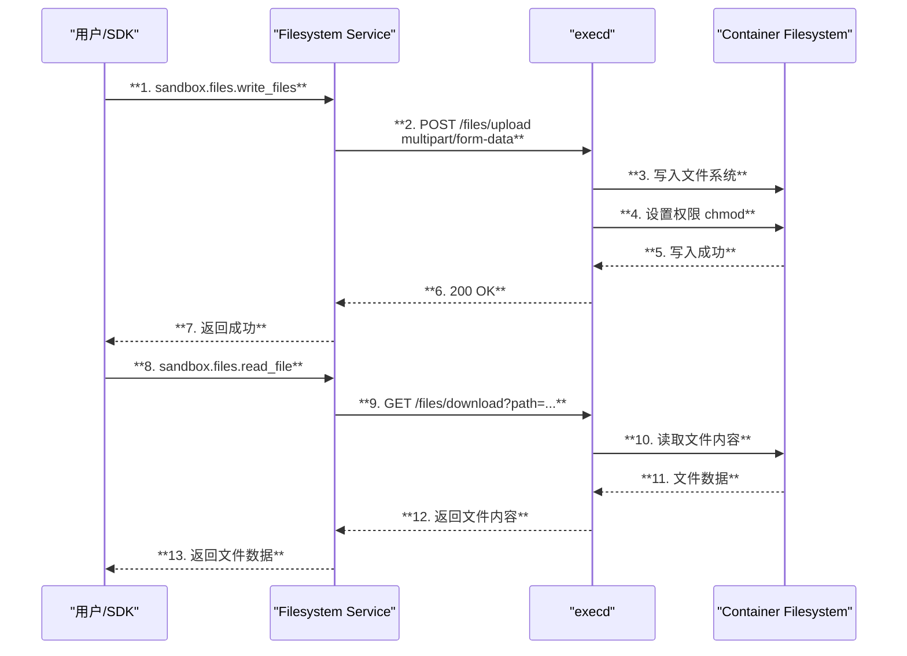
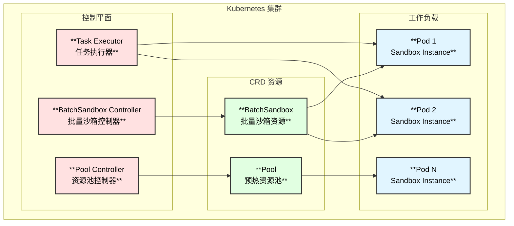
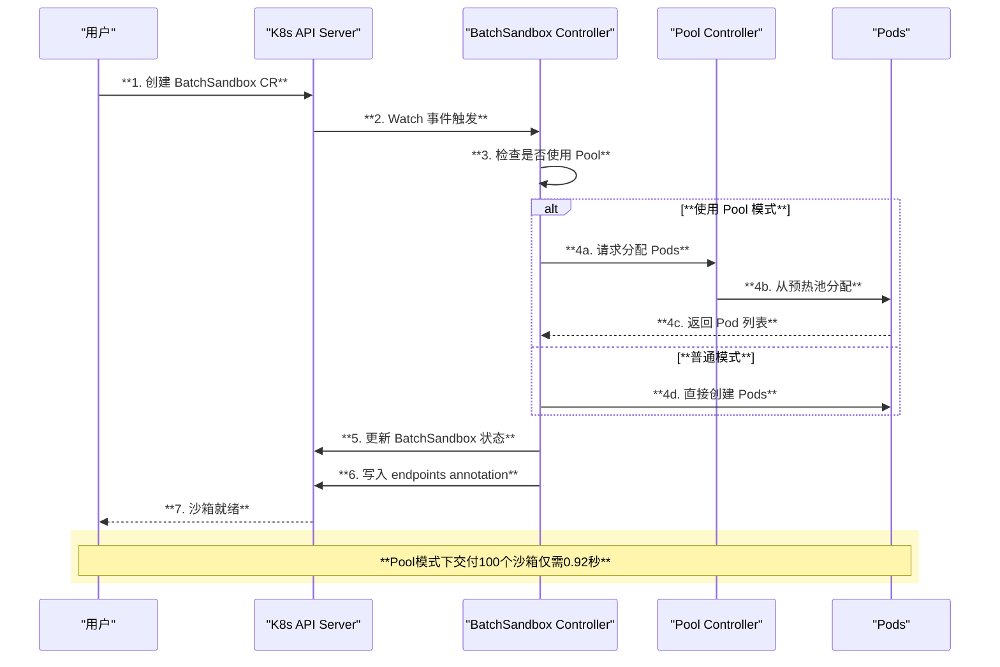

# OpenSandbox 架构分析文档

## 1. 项目概述

OpenSandbox 是由阿里巴巴开源的**通用沙箱平台**，专为 AI 应用场景设计。它提供多语言 SDK、统一的沙箱 API 以及 Docker/Kubernetes 运行时，支持 Coding Agents、GUI Agents、Agent Evaluation、AI Code Execution 和 RL Training 等场景。

### 1.1 核心特性

| 特性 | 描述 |
|------|------|
| **多语言 SDK** | 支持 Python、Java/Kotlin、JavaScript/TypeScript，Go（规划中） |
| **沙箱协议** | 定义沙箱生命周期管理 API 和沙箱执行 API |
| **运行时支持** | 默认支持 Docker 运行时，支持 Kubernetes 大规模分布式调度 |
| **沙箱环境** | 内置命令执行、文件系统、代码解释器等能力 |

### 1.2 项目结构

```
OpenSandbox/
├── sdks/                    # 多语言SDK（Python、Java/Kotlin、TypeScript）
├── specs/                   # OpenAPI规范定义
├── server/                  # Python FastAPI 沙箱生命周期服务
├── kubernetes/              # Kubernetes 控制器和部署配置
├── components/
│   ├── execd/              # 沙箱执行守护进程（Go）
│   ├── ingress/            # 流量入口代理
│   └── egress/             # 网络出口控制
├── sandboxes/              # 运行时沙箱实现
├── examples/               # 集成示例
├── oseps/                  # OpenSandbox 增强提案
└── docs/                   # 文档
```

---

## 2. 整体架构

### 2.1 架构图



### 2.2 四层架构说明

| 层级 | 组件 | 职责 |
|------|------|------|
| **SDK 层** | Python/Java/TypeScript SDK | 客户端库，提供高级抽象接口 |
| **协议层** | OpenAPI Specs | 定义标准化的 Lifecycle 和 Execution API |
| **运行时层** | Server + Docker/K8s | 管理沙箱生命周期，容器编排 |
| **实例层** | Sandbox Container + execd | 运行用户工作负载，提供执行能力 |

---

## 3. 核心组件详解

### 3.1 Server 组件（FastAPI）

Server 是沙箱生命周期管理的核心服务，基于 Python FastAPI 构建。



#### 核心 API 端点

| 端点 | 方法 | 描述 |
|------|------|------|
| `/sandboxes` | POST | 创建沙箱 |
| `/sandboxes` | GET | 列出沙箱（支持分页和过滤） |
| `/sandboxes/{id}` | GET | 获取沙箱详情 |
| `/sandboxes/{id}` | DELETE | 删除沙箱 |
| `/sandboxes/{id}/pause` | POST | 暂停沙箱 |
| `/sandboxes/{id}/resume` | POST | 恢复沙箱 |
| `/sandboxes/{id}/renew-expiration` | POST | 续期沙箱 |
| `/sandboxes/{id}/endpoints/{port}` | GET | 获取服务端点 |

### 3.2 execd 组件（Go）

execd 是注入到每个沙箱容器中的执行守护进程，基于 Gin 框架构建。



#### execd API 端点

| 类别 | 端点 | 描述 |
|------|------|------|
| **健康检查** | `GET /ping` | 服务健康检查 |
| **代码执行** | `POST /code/context` | 创建执行上下文 |
| | `POST /code` | 执行代码（流式输出） |
| | `DELETE /code` | 中断代码执行 |
| **命令执行** | `POST /command` | 执行 Shell 命令 |
| | `DELETE /command` | 中断命令执行 |
| **文件系统** | `GET /files/info` | 获取文件信息 |
| | `POST /files/upload` | 上传文件 |
| | `GET /files/download` | 下载文件 |
| | `POST /directories` | 创建目录 |
| **指标** | `GET /metrics` | 获取系统指标 |

### 3.3 SDK 组件

SDK 提供客户端接口，封装了与沙箱的所有交互。



---

## 4. 核心流程

### 4.1 沙箱创建流程



### 4.2 代码执行流程



### 4.3 文件操作流程



---

## 5. Kubernetes 运行时

### 5.1 Kubernetes Controller 架构



### 5.2 BatchSandbox 工作流程



### 5.3 性能对比

| 测试场景 | 总时间-秒 |
|---------|----------|
| SIG Agent-Sandbox - concurrency=1 | 76.35 |
| SIG Agent-Sandbox - concurrency=10 | 23.17 |
| SIG Agent-Sandbox - concurrency=50 | 33.85 |
| **BatchSandbox** | **0.92** |

> **核心差异**：Sig Agent-Sandbox 批量交付 N 个沙箱的时间复杂度为 O(N)，而 BatchSandbox 为 O(1)

---

## 6. 函数调用链

### 6.1 沙箱创建调用链

```
create_sandbox - server/src/api/lifecycle.py:66
├── ensure_entrypoint - server/src/services/validators.py
├── ensure_metadata_labels - server/src/services/validators.py
├── _prepare_creation_context - server/src/services/docker.py:574
│   ├── generate_sandbox_id - 生成UUID
│   └── 计算 expires_at
└── _provision_sandbox - server/src/services/docker.py:760
    ├── _ensure_image_available - server/src/services/docker.py:739
    │   ├── docker_client.images.get - 检查本地镜像
    │   └── _pull_image - server/src/services/docker.py:721
    │       └── docker_client.images.pull
    ├── docker_client.api.create_container - 创建容器
    ├── _prepare_sandbox_runtime - server/src/services/docker.py:569
    │   ├── _copy_execd_to_container - server/src/services/docker.py:516
    │   │   ├── _fetch_execd_archive - 获取execd二进制
    │   │   └── container.put_archive - 注入execd
    │   └── _install_bootstrap_script - server/src/services/docker.py:533
    │       └── container.put_archive - 注入启动脚本
    ├── container.start - 启动容器
    └── _schedule_expiration - server/src/services/docker.py:233
        └── Timer - 设置过期定时器
```

### 6.2 execd 路由调用链

```
NewRouter - components/execd/pkg/web/router.go:28
├── 中间件注册
│   ├── gin.Recovery
│   ├── logMiddleware - 请求日志
│   ├── accessTokenMiddleware - 令牌验证
│   └── ProxyMiddleware - 代理转发
├── /ping - controller.PingHandler
├── /files 路由组
│   ├── DELETE "" - FilesystemController.RemoveFiles
│   ├── GET /info - FilesystemController.GetFilesInfo
│   ├── POST /mv - FilesystemController.RenameFiles
│   ├── POST /permissions - FilesystemController.ChmodFiles
│   ├── GET /search - FilesystemController.SearchFiles
│   ├── POST /replace - FilesystemController.ReplaceContent
│   ├── POST /upload - FilesystemController.UploadFile
│   └── GET /download - FilesystemController.DownloadFile
├── /directories 路由组
│   ├── POST "" - FilesystemController.MakeDirs
│   └── DELETE "" - FilesystemController.RemoveDirs
├── /code 路由组
│   ├── POST "" - CodeInterpretingController.RunCode
│   ├── DELETE "" - CodeInterpretingController.InterruptCode
│   ├── POST /context - CodeInterpretingController.CreateContext
│   ├── GET /contexts - CodeInterpretingController.ListContexts
│   ├── DELETE /contexts - CodeInterpretingController.DeleteContextsByLanguage
│   ├── DELETE /contexts/:contextId - CodeInterpretingController.DeleteContext
│   └── GET /contexts/:contextId - CodeInterpretingController.GetContext
├── /command 路由组
│   ├── POST "" - CodeInterpretingController.RunCommand
│   ├── DELETE "" - CodeInterpretingController.InterruptCommand
│   ├── GET /status/:id - CodeInterpretingController.GetCommandStatus
│   └── GET /:id/logs - CodeInterpretingController.GetBackgroundCommandOutput
└── /metrics 路由组
    ├── GET "" - MetricController.GetMetrics
    └── GET /watch - MetricController.WatchMetrics
```

### 6.3 SDK Sandbox.create 调用链

```
Sandbox.create - sdks/sandbox/python/src/opensandbox/sandbox.py:351
├── ConnectionConfig.with_transport_if_missing
├── SandboxImageSpec 解析 - 支持字符串或对象
├── AdapterFactory.create_sandbox_service - 创建服务适配器
├── sandbox_service.create_sandbox - 调用 Lifecycle API
│   └── POST /sandboxes
├── sandbox_service.get_sandbox_endpoint - 获取 execd 端点
│   └── GET /sandboxes/{id}/endpoints/44772
├── 创建服务对象
│   ├── factory.create_filesystem_service
│   ├── factory.create_command_service
│   ├── factory.create_health_service
│   └── factory.create_metrics_service
└── sandbox.check_ready - 等待健康检查
    ├── is_healthy - 检查健康状态
    │   └── _ping - GET /ping
    └── asyncio.sleep - 轮询间隔
```

---

## 7. 使用场景

### 7.1 AI 代码生成与执行

```python
from opensandbox import Sandbox
from code_interpreter import CodeInterpreter, SupportedLanguage

async def ai_code_execution():
    # 创建沙箱
    sandbox = await Sandbox.create(
        "opensandbox/code-interpreter:v1.0.1",
        entrypoint=["/opt/opensandbox/code-interpreter.sh"],
        timeout=timedelta(minutes=10),
    )
    
    async with sandbox:
        # 创建代码解释器
        interpreter = await CodeInterpreter.create(sandbox)
        
        # 执行 AI 生成的代码
        result = await interpreter.codes.run(
            """
            import numpy as np
            data = np.random.randn(100)
            print(f"Mean: {data.mean():.4f}")
            print(f"Std: {data.std():.4f}")
            """,
            language=SupportedLanguage.PYTHON,
        )
        
        print(result.logs.stdout)
    
    await sandbox.kill()
```

### 7.2 浏览器自动化

支持 Chrome、Playwright 等浏览器自动化场景：

```python
sandbox = await Sandbox.create(
    "opensandbox/chrome:latest",
    entrypoint=["chrome.sh"],
    env={"DISPLAY": ":99"},
)

# 获取 VNC 端点进行可视化调试
vnc_endpoint = await sandbox.get_endpoint(5900)
```

### 7.3 远程开发环境

支持 VS Code Server、Desktop 等远程开发环境：

```python
sandbox = await Sandbox.create(
    "opensandbox/vscode:latest",
    entrypoint=["code-server", "--bind-addr", "0.0.0.0:8080"],
)

# 获取 VS Code Web 访问端点
vscode_endpoint = await sandbox.get_endpoint(8080)
```

### 7.4 RL 训练环境

支持大规模强化学习训练场景：

```yaml
apiVersion: sandbox.opensandbox.io/v1alpha1
kind: BatchSandbox
metadata:
  name: rl-training
spec:
  replicas: 100
  poolRef: rl-pool
  taskTemplate:
    spec:
      process:
        command: ["python", "train.py"]
```

---

## 8. 部署指南

### 8.1 Docker 部署

```bash
# 1. 克隆仓库
git clone https://github.com/alibaba/OpenSandbox.git
cd OpenSandbox

# 2. 启动服务
cd server
uv sync
cp example.config.toml ~/.sandbox.toml
uv run python -m src.main
```

### 8.2 Kubernetes 部署

```bash
# 1. 安装 CRD
make install

# 2. 部署控制器
make deploy IMG=<registry>/opensandbox-controller:tag \
    TASK_EXECUTOR_IMG=<registry>/opensandbox-task-executor:tag

# 3. 创建资源池
kubectl apply -f config/samples/sandbox_v1alpha1_pool.yaml

# 4. 创建批量沙箱
kubectl apply -f config/samples/sandbox_v1alpha1_batchsandbox.yaml
```

---

## 9. 总结

### 9.1 核心优势

| 优势 | 说明 |
|------|------|
| **通用性** | 支持任意容器镜像，无需修改 |
| **可扩展性** | 插件化运行时，支持自定义实现 |
| **开发友好** | 多语言 SDK，一致的 API 设计 |
| **生产就绪** | 完善的生命周期管理和可观测性 |
| **安全性** | 隔离环境，访问控制，资源限制 |
| **高性能** | Kubernetes 批量交付，O(1) 时间复杂度 |

### 9.2 架构设计原则

1. **协议优先**：所有交互通过 OpenAPI 规范定义
2. **关注点分离**：SDK、协议、运行时、执行各司其职
3. **可扩展性**：支持自定义运行时和沙箱镜像
4. **安全性**：API Key 认证、Token 认证、隔离环境
5. **可观测性**：状态转换日志、实时指标流

---

*文档生成时间：2026-01-31*
*OpenSandbox 版本：v1.0.x*
